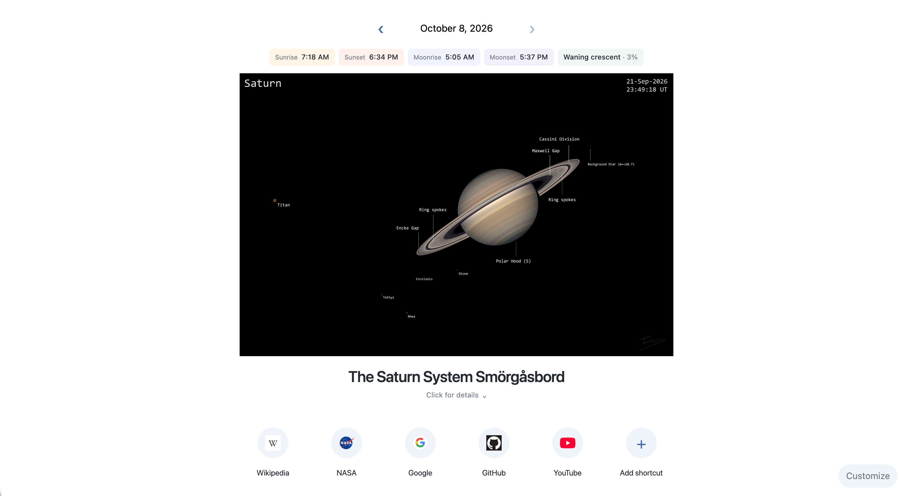

# APOD Home Page

I wanted to see the [Astronomy Picture of the Day (APOD)](https://apod.com/en/) automatically every day, but I also wanted to keep the familiar Chrome New Tab layout and site shortcuts. So I made a small extension that combines the two.

It shows the daily image above your shortcuts. Click the image title to show or hide its credits and explanation. The arrows let you browse earlier days, and **Today** takes you back to the latest picture.

Sunrise, sunset, moonrise, moonset, and moon phase appear in a small row above the image. Location and time zone are detected automatically. You can override coordinates in **Customize**.

Example homepage.

## Install

1. Download this repository using **Code → Download ZIP** and unzip it.
2. Open `chrome://extensions` and turn on **Developer mode**.
3. Click **Load unpacked** and select the **extension** folder.
4. Open a new tab. Choose **Keep it** if Chrome asks about the change.

Keep the folder on your computer. After updating its files, reload the extension at `chrome://extensions`.

No build step or dependency installation is needed.

## Notes

- If the rise/set times show dashes, allow **Location** in Chrome’s address-bar permissions, then open a fresh tab.
- **Customize** lets you edit shortcuts and change the appearance. Chrome supplies most-visited sites automatically; manually customized shortcuts need adding once.
- To hide Chrome's bottom banner, right-click it and choose **Hide footer on New Tab page**.
- No API key or account is needed. Settings stay in your browser. See [Privacy](PRIVACY.md).

The code is [MIT licensed](LICENSE). The gray New Tab icons are from [Chromium](extension/icons/LICENSE); astronomy calculations use bundled [SunCalc](extension/vendor/suncalc/LICENSE). APOD images and text retain their original credits and rights.
